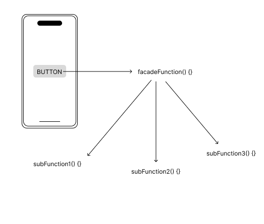
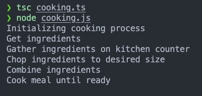

# Andrea Réthy - Entrega 1.2: Design Patterns

## Introduction

Design patterns are high-level solutions for repeating problems in software design. They do not define a clear solution, they work as a guide in finding the solution. It is important to note that the overuse of patterns would lead to overly complicated solutions for simple problems, finding the balance is the key.

### The GoF Book

The most important book published in this field to this day is the 1994 Design Patterns: Elements of Reusable Object-Oriented Software by four authors: Erich Gamma, John Vlissides, Ralph Johnson, and Richard Helm. People also refere to this book as the GoF Book (Gang of Four Book). In this book we can find the description of the 23 most common design patterns, although there were more patterns discovered since then.

#### Desing Pattern Categories

Basic, low-level patterns are called idioms and usually are related to a specific language. More high-level and universal patterns are called architectural patterns. In the GoF Book there are 3 main categories listed: Creational patterns, Structural patterns, Behavioral patterns.

Creational patterns describe how to create objects, with focus on increased flexibility and reuse of existing code. Structural patterns explain how to assemble objects and classes into larger structures while keeping these structures flexible and efficient. Behavioral patterns are concerned with algorithms and the assignment of responsibilities between objects.

## Facade

**Facade** is a structural design pattern that provides a simplified interface to a library, a framework, or any other complex set of classes.

**Usage examples:** The Facade pattern is commonly used in apps written in TypeScript. It’s especially handy when working with complex libraries and APIs.

**Identification:** Facade can be recognized in a class that has a simple interface, but delegates most of the work to other classes. Usually, facades manage the full life cycle of objects they use.

### Problem Facade is solving

When working with a broad set of objects you need to initialize them one-by-one, keep track of dependencies and use their methods in the correct order etc.

Facade is a class that provides a simple interface to a complex subsystem. It limits the functionality compared to working directly with the subsystems, but makes it much easier to use

Instead of making your code work with dozens of the framework classes directly, you create a facade class which encapsulates that functionality and hides it from the rest of the code. This structure also helps you to minimize the effort of upgrading to future versions of the framework or replacing it with another one. The only thing you’d need to change in your app would be the implementation of the facade’s methods.



#### When to use Facade?

1. Use the Facade pattern when you need to have a limited but straightforward interface to a complex subsystem.
2. Use the Facade when you want to structure a subsystem into layers.

### How to implement Facade?

1. Check if it's possible to create a simpler interface compared to what the subsystem provides. This new interface should make the client code independent from the subsystem classes (where possible)
2. Create a new facade class for this interface. The facade should redirect the calls from the client code to the proper objects of the subsystem. The facade is responsible for initializing the subsystem and managing it's lifecycle.
3. Make all the client code communicate with the subsystem only via the facade. This will protect the client code. For example when a subsystem gets upgraded to a new version, you wil only need to modify the code in the facade.
4. It is possible to create various facades to avoid the facade getting too big.

Example: Cooking

In the following example we create a facade for preparing a meal. In reality this facede combines smaller facades, but to keep the example simple let's not go into details:

```typescript
// Example for Facade implementation with an example of cooking

class BuyIngredients {

    public goToSupermarket(): string {
        return 'Go to supermarket\n';
    }

    public getIngredients(): string {
        return 'Get ingredients\n';
    }

    // ...
}

class DoPreparations {
    public prepareEquipment() {
        return 'Prepare kitchen equipment\n';
    }

    public prepareIngredients() {
        return 'Gather ingredients on kitchen counter\n';
    }

    public chopIngredients() {
        return 'Chop ingredients to desired size\n';
    }
}

class CookingProcess {
    public mixIngredients() {
        return 'Combine ingredients\n';
    }

    public cookIngredients() {
        return 'Cook meal until ready\n';
    }
}


class prepareMealFacade {
    // Declaring subsystems
    protected buyIngredients: BuyIngredients;
    protected doPreparations: DoPreparations; 
    protected cookingProcess: CookingProcess;

    // create the subsystem objects
    constructor(buyIngredients?: BuyIngredients, doPreparations?: DoPreparations, cookingProcess?: CookingProcess) {
        this.buyIngredients = new BuyIngredients();
        this.doPreparations = new DoPreparations();
        this.cookingProcess = new CookingProcess();
    }

    // Call the subsystem methods. Some methods might not be available on the facade

    public cookMeal(): string {
        let process = 'Initializing cooking process\n';
        process += this.buyIngredients.getIngredients();
        process += this.doPreparations.prepareIngredients();
        process += this.doPreparations.chopIngredients();
        process += this.cookingProcess.mixIngredients();
        process += this.cookingProcess.cookIngredients();

        return process;
    }
}

// clientCode uses facade for a simple interface
function iAmHungry(facade: prepareMealFacade) {
    console.log(facade.cookMeal());
}

const facade = new prepareMealFacade();
iAmHungry(facade);
```

When running this example in the console we get this result:



## Sources

https://refactoring.guru/design-patterns/facade
